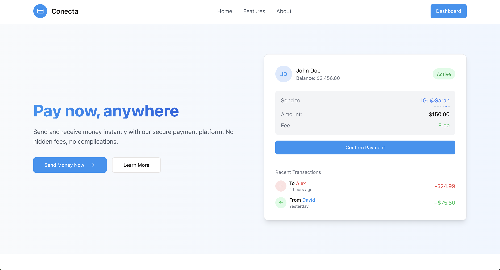

# Conecta

> Pay now, anywhere

Demo [here](https://conecta-y6it.vercel.app/)

Demo video [here]()



## Overview

Conecta is a decentralized payment platform that enables borderless transactions using stablecoins. Send and receive payments globally with minimal fees and instant settlements.

## Features

- **Multi-Currency Support**: Choose from USDC, EURC, BRZ (Brazilian Real), and MXN (Mexican Peso)
- **Cross-Network Compatibility**: Operates on Base and Mantle networks
- **Flexible Settlement**: Select your preferred stablecoin for receiving payments
- **Real-Time Conversion**: Automatic currency conversion at market rates

## How It Works

Let's say you're a business owner in Brazil receiving payment from a client in Mexico:

1. Set your preferred settlement currency (e.g., BRZ)
2. Share your payment link with your client
3. Client pays in their local currency (MXN)
4. You receive the payment in BRZ automatically


## Supported Networks & Tokens

### Base Network

**Contracts**: 

- [StablecoinRouter.sol]()
- [SwapExecutorHook.sol]()

**Tokens**:
- USDC: `0x833589fCD6eDb6E08f4c7C32D4f71b54bdA02913`
- EURC: `0x60a3E35Cc302bFA44Cb288Bc5a4F316Fdb1adb42`
- MXN (XOC): `0xa411c9Aa00E020e4f88Bc19996d29c5B7ADB4ACf` 
- BRZ: `0xE9185Ee218cae427aF7B9764A011bb89FeA761B4`

### Sepolia Base Network

- [StablecoinRouter.sol](https://sepolia.basescan.org/address/0xbfcd12344415bf2e7620c393c5a6dd9623af4cf3#code)
- [SwapExecutorHook.sol](https://sepolia.basescan.org/address/0x8f247942769d063e73222b11719dc8f2e17cac24#code)

**Tokens**:
- USDC: `0xCd099308b66804E73d89e766923130FCda19b703`
- MXN (XOC): `0x22F926E1A35A435484Ae1445f750A2E8C21754Dc`

## Deployment

Deployment and verification on Sepolia Base:
```bash
forge script contracts/scripts/DeployStablecoinRouter.s.sol:DeployStablecoinRouterSepoliaBase --rpc-url $BASE_SEPOLIA_RPC_URL --account <nameAccount> --sender $SENDER_KEY --broadcast --verify --etherscan-api-key $BASESCAN_API_KEY -vvvv
```

Deployment and verification on Base:
```bash
forge script contracts/scripts/DeployStablecoinRouter.s.sol:DeployStablecoinRouterSepoliaBase --rpc-url $BASE_RPC_URL --account <nameAccount> --sender $SENDER_KEY --broadcast --verify --etherscan-api-key $BASESCAN_API_KEY -vvvv
```
