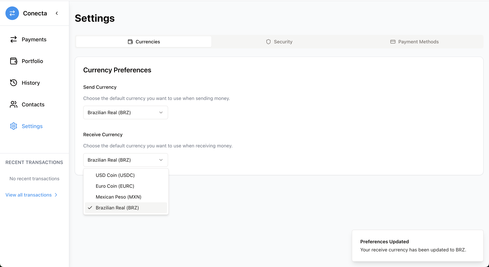

# Conecta

Pay anyone, anywhere

Conecta allows anyone to send and receive payments anywhere in the world.

Conecta let you select in which stablecoin you want to receive payments. 

Let's suppose you are a small business in Brazil and need to receive a payment from someone in Mexico. You can select the preferred stablecoin you want receive your payment

